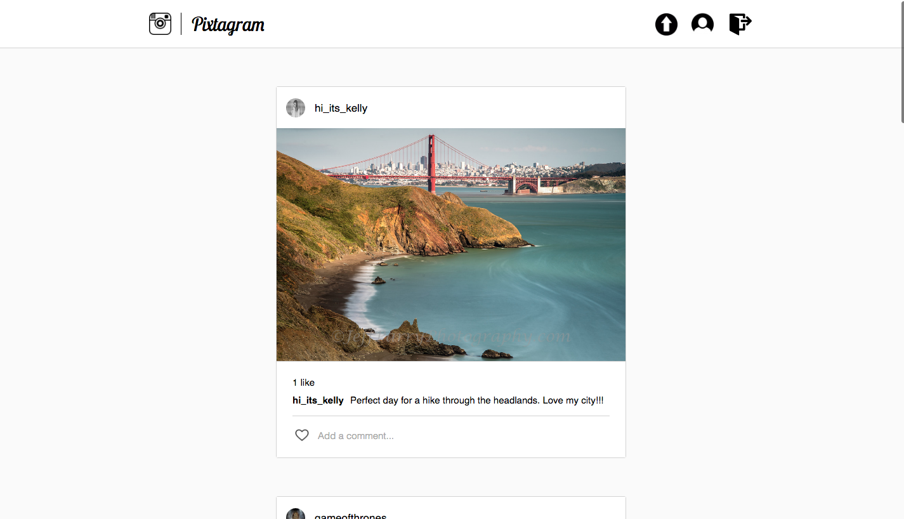

# Pixtagram

[Pixtagram live](kevinmoore.herokuapp.com)

Pixtagram is a full stack web application clone of Instagram. It was built
using ruby on rails in the backend, React.js with a Redux framework in the frontend,
and a PostgreSQL database.

## Features
s
* User account creation and login with secure authentication
* Photo uploading to a users profile page
* Photo feed of your followed users
* Liking/un-liking photos
* Commenting on photos
* Following users and their photo feed

## Highlights

### Store
  The key feature of this application is that it is a single page app
  with all logic and communication between the front and back ends
  happening without forcing a complete re-render. This is accomplished
  by keeping a front-end store with three main components: currentUser,
  photos, and profileDetail. The store is updated and displays updated
  information in real time and communicates the updates to the database
  simultaneously.

### Photos
  The obvious primary feature of the application are the photos. At the database level, the photos hold all of the information on likes and comments and are rendered using one of two containers dependent on their needed information: ProfileIndexContainer or FeedIndexContainer. Each of these render their IndexItem subcomponents which are responsible for holding all of the logic for an individual photo.

  A final photo container, PostContainer, maps all of the necessary information from the store that is used in the posting of a new photo.

### Follows / Following Feed
  Upon entering the site, Pixtagram will render a feed of photos from
  users which the logged in profile has followed. A user can edit this
  following feed by choosing to follow/unfollow other users from their
  profile page. There is also an "explore all" option at the end of the
  main feed so users can explore photos beyond just those that they are
  following.

### UI/UX
  The UI and UX of Pixtagram are based closely off of those of Instagram.
  It is intended to be an almost cloned copy with slightly different features
  and implementation of technologies.

### Database
  The database holds four primary tables with corresponding API endpoints:
    * Users
    * Session
    * Photos
    * Comments

  The additional logic of the application (likes/follows) is handled within these four databases.

## Technology

Pixtagram uses a variety of technologies in its implementation including:
  * Ruby on Rails
  * Heroku
  * PostgreSQL
  * Cloudinary
  * React.js w/ Redux
  * jQuery
  * Sass

## Future Additions

Pixtagram is currently a representation of the minimum viable product of
an Instagram-type web application. In the coming weeks, I will be adding
various new features to flush out the application including:

* Tags
* User/Tag search
* Profile Editing
* Direct messaging
